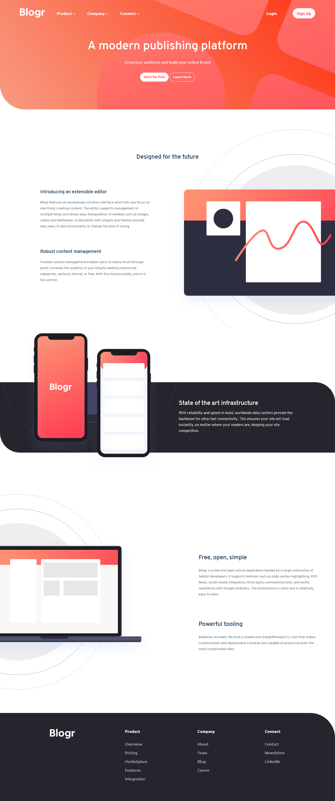

# Blogr Landing Page

## Table of contents

- [Overview](#overview)
  - [Summary](#summary)
  - [The challenge](#the-challenge)
  - [Screenshot](#screenshot)
  - [Links](#links)
- [My process](#my-process)
  - [Built with](#built-with)
  - [What I learned](#what-i-learned)
  - [Continued development](#continued-development)
  - [Useful resources](#useful-resources)
- [Author](#author)
- [Acknowledgments](#acknowledgments)

## Overview

### Summary

> This is a simple landing page with a cool nav-bar animation for the mobile-devices

### The challenge

Users should be able to:

- View the optimal layout for the site depending on their device's screen size
- See hover states for all interactive elements on the page

### Screenshot



### Links

- Live Site URL: [Website link of my solution](https://codeswithroh-blogr-landing-page.netlify.app/)

## My process

### Built with

- HTML
- CSS
- Flexbox
- CSS Grid
- Mobile-first workflow
- JavaScript


### What I learned

*I learned a lot from this project. Since, this is my first attempt at full responsive website so, it took me a lot of time but it was worth it. I experimented a lot with different componentts and at last I figured a way to make it work.* 

To see how you can add code snippets, see below:

>A new css property that I learned in this project
```css
.proud-of-this-css {
  clip-path:circle(100px at 90% -10%)
  -webkit-clip-path:circle(100px at 90% -10%)
}
```
*The above code basically clips the position mentioned above like 90% and -10%
in the shape of a circle. So, its like creating a mask to cover the whole background.*


### Continued development

Since, this is my first attempt at full responsive website. So, its not perfect. Thatiswhy I will work on making responsive designs more efficiently.

## Author

- Website - [Rohit Purkait](https://www.your-site.com)
- Frontend Mentor - [@codeswithroh](https://www.frontendmentor.io/profile/codeswithroh)
- Github - [@codeswithroh](https://github.com/codeswithroh)


## Acknowledgments

I would like to thank `Google` for sticking with me through thick and thin. Without you my project would not have been completed.
